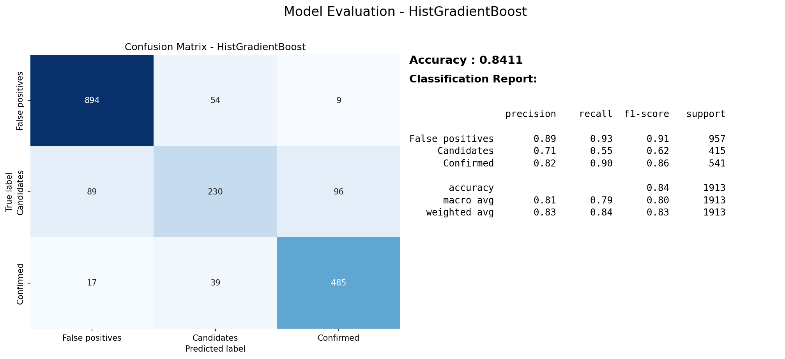

# Gradient Boosting Decision Tree and Fast Automatic Feature Engineering Using Single Neurons for Kepler Exoplanet Dataset
## Dataset
https://www.kaggle.com/datasets/gauravkumar2525/kepler-exoplanet-dataset

The Dataset is  from kaggle,The Kepler Exopl
anet Candidates Dataset contains data on pot
ential exoplanets discovered by NASA's Kepler 
Space Telescope.  It includes planetary attributes 
such as radius, equilibrium temperature, orbital 
period, stellar properties, and detection scores.

Original Input Feature : 
* kepoi_name – Unique identifier for the 
planetary candidate. 
* koi_score – Confidence score for the 
planetary classification (higher values 
indicate stronger confidence).
* koi_period – Orbital period of the 
planet (in days).
 koi_prad – Estimated planetary radius 
(in Earth radii).
* koi_teq – Estimated equilibrium 
temperature of the planet (Kelvin).
* koi_insol – Insolation flux received by 
the planet (relative to Earth's insolation).
* koi_steff – Effective temperature of the 
host star (Kelvin).
* koi_srad – Stellar radius (in solar radii).
* koi_slogg – Surface gravity of the host 
star (logarithmic scale, in cm/s²).
* koi_kepmag – Kepler-band magnitude 
(brightness of the star as observed by 
Kepler).

Label / Answer : koi_disposition, Status of the 
exoplanet candidate. Candidate planets can be 
classified as confirmed exoplanets (2), candid
ates (1), or false positives (0).
3 category. Train : 80% , Test : 20%
The data set contains 9,564 records

## Models
Fixed the random seed for every model. 
Model : Perceptron, Passive Aggressive, SVM, 
Decision Tree, XGBoost, AdaBoost, Random 
Forest, Hist Gradient Boost.
Every model which list in Other Model 
implement with scikit-learn API and set at default 
mode and default parameter, for ensemble 
models are 100 estimators

###  Residual Aware Classification
Residual-Aware Stack Regression was one 
of key module that I designed for “Rental Price 
Prediction in a Housing Rental Support System” . 
And in this little project, I tried to redesign it 
applicable to Classification Task. 
First, I changed Label (Numeric) to  One-Hot 
Encoded data. Classification problems are not 
about a single numerical value, but rather about 
the probability distribution of categories. Hence, 
I made it learning residual in logit space.
* logit = log(prob)
* residual = y_logit - base_logit 
* final_logit = base_logit + residual
* return softmax(logit + residual) 

then softmax to probability as outcome and 
argmax to category .

Unfortunately, in the experiment result 1 that 
shows the categorized version of RAS did not 
bring a significant improvement like the 
regression version.

Residual Aware Stack Regression :
https://github.com/JiaenSuen/TinyAI/tree/main/DataScience%26ML/ResidualAwareML-RentalHousePricePredict

##  Experiment Result  I
|Model|Accuracy|
|----------------|---------------|
|  Perceptron    |40.93 %|
| Passive Aggressive| 59.12 %|
| SVM | 64.61 %|
| Decision Tree |  79.09 % |
| XGBoost |  83.01 % |
| AdaBoost | 81.39 % |
|  Random Forest |  83.64 % |
| Hist Gradient Boost | **84.11 %** |
| RAS-XGXG |  83.43 % |

In comparison, it’s interesting that Hist Gradient 
Boost got little higher than others. Based on my 
past experiments, it's likely that the Hist Gradient 
Boost model requires a relatively large amount of 
data, approximately 6000 or more, to perform 
well. Next, using the perceptron as a benchmark, 
other robustly enhanced linear models, such as 
SVM and Passive Aggressive, can exhibit growth 
potential, while ensemble gradient boosting 
models can achieve very stable and accurate 
learning and generalization capabilities. Ablation 
experiments revealed that, for this dataset, 
stacking two XGBs in RAS resulted in slightly 
better performance.

## Auto Feature Engineering
Faced with the bottleneck in model improv
ement, I decided to try experimenting with the 
input features.

Here, I implemented a   method performs 
lightweight automatic feature engineering 
followed by Perceptron-based feature 
screening. Categor-ical variables are encoded 
using One-Hot Encoding for low-cardinality 
features and Label Encoding for high
cardinality features to balance representation 
quality and dimensional efficiency. Numerical 
variables are expanded with interaction features 
(multiplicative combinations), following the 
concept of polynomial feature interactions to 
capture nonlinear relationships. Finally, a 
Perceptron classifier evaluates each feature 
individually, and only features with sufficient 
predictive power are retained. This allows the 
system to automatically discover effective 
feature patterns and interactions while 
keeping the pipeline simple and computationally 
efficient. 

##  Experiment Result  II
Experiment Result 2 shows that replace the 
original label encoder method by auto feature 
engineering function.

|Model|Accuracy|
|----------------|---------------|
|  Perceptron    |49.76 %|
| Passive Aggressive|  47.73 %|
| SVM |  50.03 %|
| Decision Tree |   100.0 % |
| XGBoost |  100.0 % |
| AdaBoost | 100.0 % |
|  Random Forest |  100.0 % |
| Hist Gradient Boost |  100.0 % |
| RAS-XGXG | 100.0 % |

Surprisingly, by constructing new input patterns 
through automated feature engineering, decision 
trees and all integrated gradient boosting models 
achieved 100.0% accuracy on the test dataset.

##  Conclusion
During the experiments, I initially assumed 
stronger classifiers would yield better perfor
mance. However, results showed that improving 
feature representations often produced larger 
gains than increasing model complexity. To 
address this, I introduced additional feature 
engineering and used a Perceptron-based screen
ing process to identify useful features, shifting 
the focus toward feature pattern discovery.
Two key observations emerged. First, well
designed feature interactions can improve accu
racy more than switching to stronger models, 
especially when combined with ensemble grad
ient boosting. Second, although the Perceptron is 
largely outdated as a standalone classifier, it 
works effectively as a lightweight feature
engineering agent for quickly identifying useful 
feature patterns.

## Result Visualization
With no auto feature engineering
 (Hist Gradient Boost)

