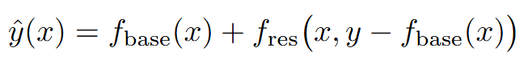
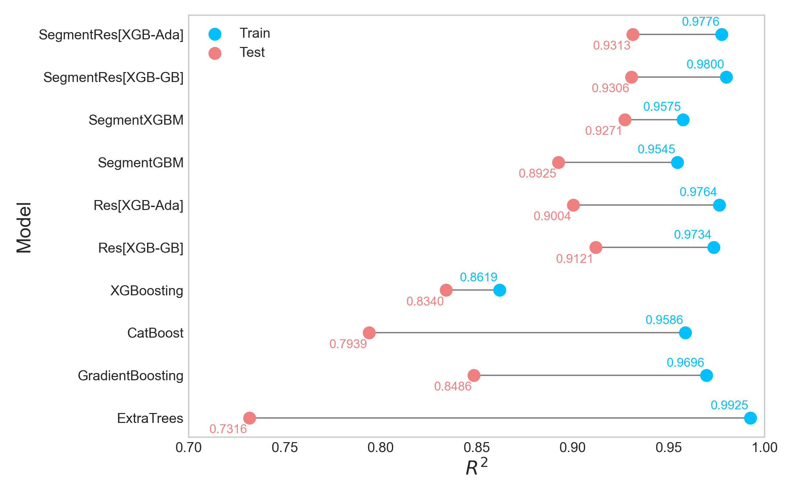
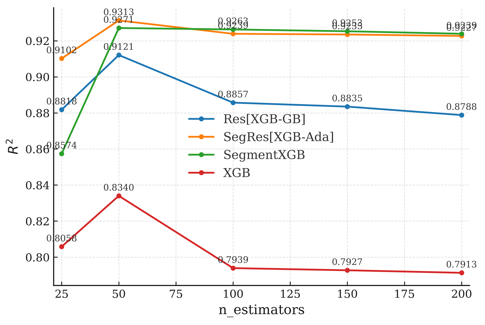

# Rental Price Prediction in a Housing Rental Support System Using Residual Aware Learning Module 
*Published at 2025  TANet Conference ,Taiwan*

## Introduction
This study introduces Residual-Aware Stacking (RAS) and segmented regression.
RAS improves overall prediction accuracy and robustness by modeling residuals to compensate for the limitations of base models. Segmented regression, on the other hand, captures heterogeneous relationships across different price ranges, avoiding the use of a single global function to force-fit the entire dataset. This approach achieves better local accuracy within each segment while maintaining global generalization capability.
By combining these two methods, the platform enhances prediction and recommendation performance at both global and local levels.

In terms of experimental design, this study not only incorporates embedded models, but also generalizes and structurally compares commonly used boosting models and ensemble methods. The effectiveness of different model combinations is evaluated through interval partitioning and residual learning structures.
All models undergo hyperparameter tuning, and comparisons are conducted using the parameter configurations that achieve the best performance on the validation set. For tree-based boosting models, a coarse-grained tuning process is performed by varying the number of trees (50, 100, 150, and 200) to assess the optimal configuration.

##  Residual-Aware Stacking
Single models or commonly used ensemble methods can fit the data reasonably well, but they often fail to capture certain local patterns. This issue becomes more pronounced in scenarios involving strong nonlinearity and complex feature interactions, where systematic errors are likely to remain. To improve both generalization capability and predictive accuracy, a residual correction model is introduced to better learn the complex patterns present in the data.

In the first stage, a base model is trained and generates predictions on both the training and validation datasets. Residuals are then computed as the difference between the ground-truth labels and the model predictions, representing the portion of the data that the base model fails to learn. These residuals correspond to the errors of the first-layer model.

In the second stage, a residual model is trained using the residuals as labels. The predicted residuals are treated as corrective signals and added to the base model’s predictions to form the final output. Experimental results show that this two-stage residual learning structure significantly outperforms single machine learning models on the test set, demonstrating stronger generalization ability.

## Piecewise Regression / Segmented Modeling
In housing price prediction, small-sized and large-sized properties often exhibit fundamentally different price distribution characteristics. A single model struggles to simultaneously capture patterns across these heterogeneous regions. To address this issue, a piecewise regression approach is adopted.

The dataset is partitioned into two subsets using the median of the house size feature as a threshold. Separate regression models are trained for each segment, allowing each model to focus on the specific characteristics of its corresponding region. By performing interval-based data partitioning along the size dimension and training dedicated models for each segment, this approach avoids the generalization difficulties that arise when a single model is forced to fit heterogeneous distributions, and better adapts to the structural differences in the data.

## Combined Segmentation and Residual Learning
The experiments further explore the combination of segmentation-based modeling and residual learning structures across several commonly used models. Interval partitioning prevents models from fitting the entire heterogeneous dataset with a single global function, while residual learning is applied within each segment to further refine predictions.

By integrating piecewise regression with residual learning, the proposed framework simultaneously improves local prediction accuracy within each segment and enhances overall generalization performance.

## Experimental Results
The proposed SegmentRes model significantly outperforms traditional machine learning models in housing price prediction accuracy. When evaluated using the coefficient of determination (R²) as the goodness-of-fit metric, the model achieves the highest R² scores on both the training and test sets. The training R² exceeds 0.9, while the test R² remains within the range of 0.8 to 0.9, indicating strong fitting capability along with good generalization performance. The relatively small gap between training and test R² further suggests that the model effectively avoids overfitting.

To examine the performance of the proposed approach under different base model size configurations, we compare the R² performance of standard XGBoost, a residual model (Res[XGB-GB]), a segmented model (SegmentXGB), and the proposed SegRes[XGB-Ada], which integrates both residual learning and segmentation.

The results show that standard XGBoost exhibits a decline in R² as the number of base estimators increases. Overfitting begins to emerge when n_estimators exceeds 100, with performance dropping to approximately 0.79, indicating instability of a single-model architecture under high complexity. In contrast, Res[XGB-GB] partially mitigates this issue through residual correction, but still shows a slight performance degradation as the number of estimators increases.

Both SegmentXGB and SegRes[XGB-Ada] maintain stable R² values above 0.92 across different estimator settings. At n_estimators = 50, SegmentXGB and SegRes[XGB-Ada] achieve their best performances with R² scores of 0.9271 and 0.9313, respectively. These results demonstrate that segmented regression effectively captures the heterogeneity of the housing rental market, while the integration of residual correction in SegRes[XGB-Ada] further enhances model robustness and generalization capability.

## Code Module
* Residula Aware Stack : ResdiualML.py
* Piecewise Regression : PiecewiseRegressionML.py