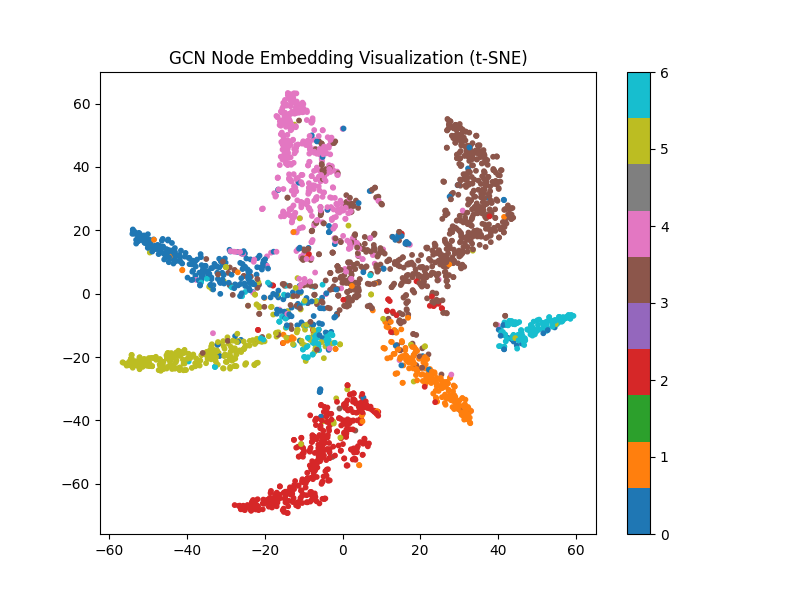

# CoRA with Graph Neural Network 
In deep learning, graph information can be used for classification or recommendation tasks. This project ,try to implement the entire GNN ( Graph Neural Network ) model and perform a classification task using the cora dataset.   
## CoRA Dataset
The Cora Citation Dataset is a classic benchmark widely used in graph neural networks and document classification research. It consists of 2,708 scientific papers (nodes) connected by 5,429 citation links (edges). Each paper is represented by a 1,433-dimensional bag-of-words feature vector and labeled into 7 research topic classes, such as Neural Networks and Rule Learning. Thanks to its moderate size and well-defined structure, Cora is commonly used as a standard dataset for evaluating models like GCN and GAT.  

## GNN
Graph Neural Networks (GNNs) are a family of deep learning models designed for graph-structured data.  
Each node aggregates information from its neighbors layer by layer, learning representations that capture both node features and graph structure.

## GCN
Graph Convolutional Networks (GCNs) extend the idea of convolution to graphs by aggregating and normalizing features from neighboring nodes. GCNs are simple, efficient, and commonly used for semi-supervised node classification tasks, such as citation networks like Cora.  
## GAT
Graph Attention Networks (GATs) enhance GCNs by introducing an attention mechanism. Instead of treating all neighbors equally, GAT learns attention weights that indicate how important each neighbor is.

## Result with GCN
| Class | Precision | Recall | F1-score | Support |
|-------|-----------|--------|----------|---------|
| 0     | 0.66      | 0.78   | 0.71     | 130     |
| 1     | 0.77      | 0.88   | 0.82     | 91      |
| 2     | 0.90      | 0.91   | 0.90     | 144     |
| 3     | 0.91      | 0.75   | 0.82     | 319     |
| 4     | 0.77      | 0.84   | 0.80     | 149     |
| 5     | 0.84      | 0.74   | 0.79     | 103     |
| 6     | 0.70      | 0.89   | 0.79     | 64      |
| **Accuracy**    |           |        | 0.81     | 1000    |
| **Macro Avg**   | 0.79      | 0.83   | 0.80     | 1000    |
| **Weighted Avg**| 0.82      | 0.81   | 0.81     | 1000    |

  
 