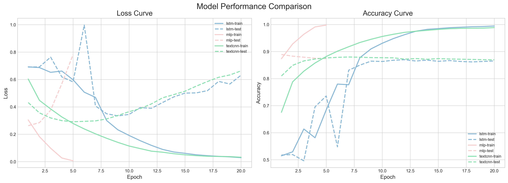

## **IMDB Sentiment Classification with PyTorch**

This a small NLP project which I first made in 2022 or 2023,  
Recently(2025/6), I re-implemented and reorganized it  
There demonstrating a complete pipeline for binary sentiment   classification  
on the IMDB dataset using PyTorch. This repository covers ,

* Data ingestion with pandas
* Custom tokenizer and vocabulary building
* PyTorch Dataset and DataLoader setup
* Model definition: Embedding + LSTM
* Training loop with loss and accuracy metrics
* Inference function for single-sentence prediction

#### Data Structure

    IMDB Dataset.csv [ review : str  ,  sentiment : str ]

## Data Preparation

1. **Simple Tokenization**

   * Remove any HTML tags from the raw review text so that only plain content remains.
   * Convert all characters to lowercase to avoid treating “Movie” and “movie” as different tokens.
   * Split the cleaned text into a sequence of word‑like units by matching contiguous letters and digits.

    
2. **Building the Vocabulary**

   * Apply the tokenizer to every review in the dataset and collect all resulting tokens.
   * Count how often each token appears across the entire corpus.
   * Select the top N most frequent tokens (e.g. 10 000) to form the core vocabulary.
   * Reserve two special entries: one for padding shorter sequences (“`<PAD>`”) and one for unknown or rare words (“`<UNK>`”).
   * Assign each token in this final list a unique integer index.
3. **Mapping Tokens to IDs**

   * For each token in a tokenized review, look up its integer index from the vocabulary.
   * If a token is not found, substitute the index reserved for “`<UNK>`.”
4. **Dataset Preparation**

   * When loading a single example, read its raw review text and its binary sentiment label (already converted to 0 or 1).
   * Tokenize the text and convert each token to its corresponding ID.
   * If the resulting ID sequence is shorter than the fixed maximum length, pad it at the end with the “`<PAD>`” index; if it is longer, truncate it to that maximum length.
   * Return a pair of tensors for the model:
     1. **input_ids** : a 1 × max_length tensor of token IDs
     2. **label** : a scalar tensor holding the binary sentiment label

Together, this pipeline transforms raw text reviews into fixed‑length numeric sequences, ready to be fed into an embedding layer and neural network for sentiment classification.

## Model

**Model Architecture**

1. **Embedding Layer**
   * Accepts a batch of token‑ID sequences (shape: batch_size × sequence_length).
   * Maps each integer ID to a fixed‑size dense vector (embedding_dim).
   * Learns these vectors during training so that semantically similar words end up with similar representations.
2. **LSTM Layer**
   * Processes the sequence of embeddings in order, capturing contextual information and long‑range dependencies.
   * Operates over the time dimension (the sequence length) with hidden size = hidden_dim.
   * Outputs the final hidden state for each sequence, which serves as a summary representation of the entire review.
3. **Classification Head**
   * A single linear layer that projects the LSTM’s final hidden state (size hidden_dim) down to the number of target classes (2: positive vs. negative).
   * Produces raw scores (“logits”) for each class.
4. **Forward Pass Flow**
   * Input token IDs → Embedding → LSTM → take the last hidden state → Linear → logits.
   * These logits are then passed into a loss function (e.g. cross‑entropy) or a softmax for probability estimates.

---

**Training Procedure**

1. **Setup**
   * Instantiate the model with the vocabulary size, embedding dimension, LSTM hidden dimension, and number of classes.
   * Move model to the available device (CPU or GPU).
   * Define a loss function (CrossEntropyLoss) and an optimizer (e.g. Adam).
2. **Epoch Loop**
   * For each epoch (full pass over the training set):

     1. **Training Mode** : set the model to train mode.
     2. **Batch Loop** : for each mini‑batch from the DataLoader:

     * Move input IDs and labels to the device.
     * Perform a forward pass to obtain logits.
     * Compute the loss between logits and true labels.
     * Zero out previous gradients.
     * Backpropagate the loss to compute current gradients.
     * Step the optimizer to update all model parameters (including embeddings).
     * Accumulate batch loss and count correct predictions.

     1. **Metrics Calculation** : after all batches, compute average loss and overall accuracy for the epoch.
     2. **Logging** : print or log the epoch’s training loss and accuracy.
3. **Inference**
   * Switch the model to evaluation mode.
   * Tokenize and convert an input review to IDs, pad or truncate to the fixed length.
   * Run a forward pass without computing gradients.
   * Apply softmax to logits to obtain class probabilities.
   * Select the class with the highest probability as the predicted sentiment, and report its probability as a confidence score.

---

| review                                               | sentiment |
| ---------------------------------------------------- | --------- |
| One of the other reviewers has mentioned that ...    | 1         |
| A wonderful little production.`  `The... | 1         |
| I thought this was a wonderful way to spend ti...    | 1         |
| Basically there's a family where a little boy ...    | 0         |
| Petter Mattei's "Love in the Time of Money" is...    | 1         |

---

Text → tokenizer → vocab lookup → embedding → LSTM → hidden layer → linear → softmax → Classify

---

### Training Record

Epoch  1: Loss = 0.6836, Accuracy = 0.5552   
Epoch  2: Loss = 0.6160, Accuracy = 0.6545   
Epoch  3: Loss = 0.4205, Accuracy = 0.8128  
Epoch  4: Loss = 0.3320, Accuracy = 0.8597  
Epoch  5: Loss = 0.2728, Accuracy = 0.8891  
Epoch  6: Loss = 0.2168, Accuracy = 0.9156  
Epoch  7: Loss = 0.1623, Accuracy = 0.9395  
Epoch  8: Loss = 0.1145, Accuracy = 0.9601  
Epoch  9: Loss = 0.0770, Accuracy = 0.9744  
Epoch 10: Loss = 0.0619, Accuracy = 0.9791  
Epoch 11: Loss = 0.0442, Accuracy = 0.9864  
Epoch 12: Loss = 0.0307, Accuracy = 0.9918  
Epoch 13: Loss = 0.0287, Accuracy = 0.9918  
Epoch 14: Loss = 0.0235, Accuracy = 0.9938  
Epoch 15: Loss = 0.0223, Accuracy = 0.9941  
Epoch 16: Loss = 0.0164, Accuracy = 0.9958  
Epoch 17: Loss = 0.0161, Accuracy = 0.9956  
Epoch 18: Loss = 0.0147, Accuracy = 0.9962  
Epoch 19: Loss = 0.0214, Accuracy = 0.9940   

### Test Dataset Performence

Test Accuracy = 0.9606

### Case Demo

input : "This movie is fantastic! I really loved it."  
Preduct Result: positive, Prob: 0.9971
