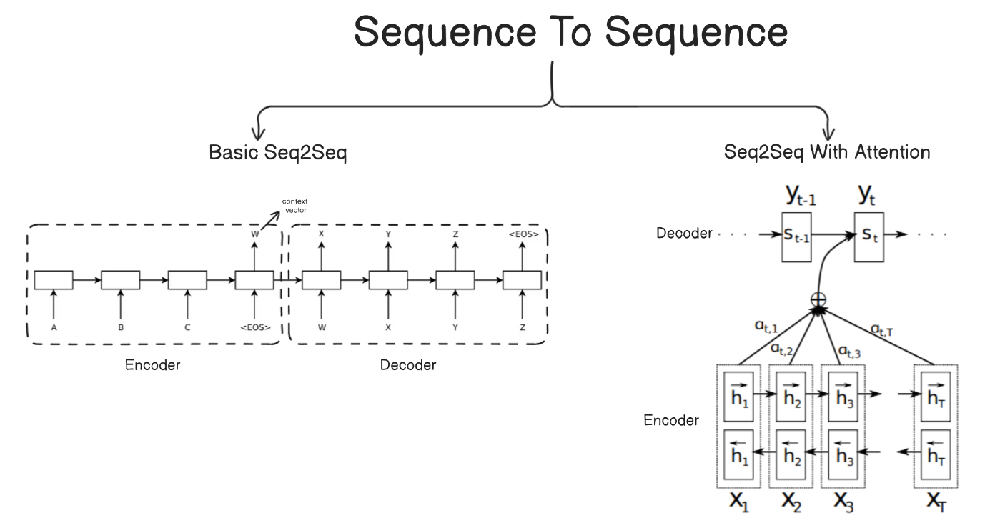

# Machine Translation (English to German) , Sequence-to-Sequence
## Multi 30k Machine Translation Dataset
English to German
https://www.kaggle.com/datasets/hemanthkumar21/multi30k-de-en


## Introduction
This is a little project experimenting with classic Seq2Seq models in PyTorch. Translating short English  descriptions to German using the Multi30k dataset (it's basically Flickr30k images with one English caption per image professionally translated to German). There are ~29k training pairs, 1k val, and 1k test for quick experiments.
 

## Machine Translation
Machine translation (MT) has come a long way, but the real revolution in neural approaches kicked off around 2014 with the rise of Seq2Seq models.

The shift to neural machine translation (NMT) began with Seq2Seq architectures in 2014–2015. Pioneered by papers like Sutskever et al. (2014) and Cho et al. (2014), these used an RNN/LSTM encoder to compress the source sentence into a fixed-length vector, then a decoder to generate the target sentence step-by-step.

Vanilla Seq2Seq worked okay for short sentences but struggled with long ones due to the bottleneck of squeezing everything into one vector.
This was quickly fixed in 2015–2017 with attention mechanisms (Bahdanau et al. 2015, Luong et al. 2015). Attention lets the decoder dynamically focus on relevant parts of the source at each step, dramatically improving alignment and performance.

The big breakthrough came in 2017 with the Transformer model . It ditched RNNs entirely, relying on self-attention for full parallelism, better long-range dependencies, and scalability.  After that, massive pretrained models (mBART, M2M), multilingual systems, and LLMs fine-tuned for translation – but Seq2Seq with attention remains the core idea behind it all.

## Experimental model

* Vanilla LSTM Seq2Seq (encoder compresses source to fixed vector, decoder generates from that)
* LSTM Seq2Seq with Luong-style dot-product attention (helps the decoder focus on relevant parts of the source)


## Seq2Seq
Encoder-decoder setup. Encoder reads the English sentence and produces hidden states. In vanilla mode, only the final hidden/cell go to the decoder. With attention, the decoder gets all encoder outputs and computes a context vector each step.
```
src_text ──→ src_ids ──→ Encoder  
 → Decoder ──→ tgt_ids ──→ tgt_text
tgt_text ──→ tgt_ids ──┘
```


## Training 
It may cost a lot of time on build vocabulary  
Epochs :  100~


## Key Implementation Stuff

* Tokenizer: Uses a simple multilingual one (probably based on spaCy or basic split).  
* Vocab: Built on-the-fly from training data, with PAD, UNK, BOS, EOS.
* Training: Teacher forcing (ratio 0.5), Adam, cross-entropy (ignore PAD), grad clipping.
* Inference: Greedy decoding (argmax), stops at <EOS> or max_len.
* Eval: Loss + token accuracy + sentence-level BLEU (with smoothing).


 


## Training Result
Trained on a single GPU for ~100 epochs:
* With Attention: Test BLEU ~ 0.2077
