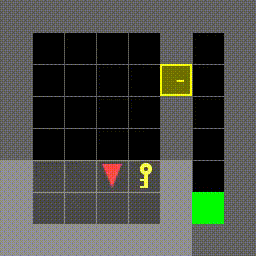

# MiniGrid Spatial Navigation and Exploration Experiment: CNN-LSTM Based Deep Reinforcement Learning

## Intoduction
This project focuses on spatial exploration, behavior, action tasks, and logical decision-making for small- to medium-sized robotic vehicles or autonomous systems. The concept originates from a recent personal experimental extension involving stereo vision systems applied to robotic autonomous systems. 

By leveraging Bird’s Eye View information generated from binocular stereo vision estimation and visual recognition, the project aims to develop a reinforcement learning–based algorithmic model that enables the system to explore space and autonomously complete tasks independently. 

