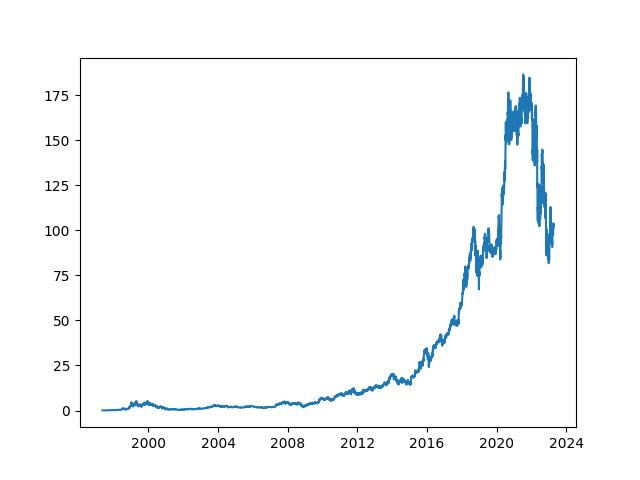
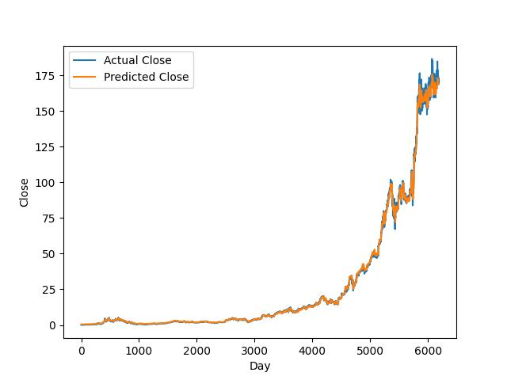
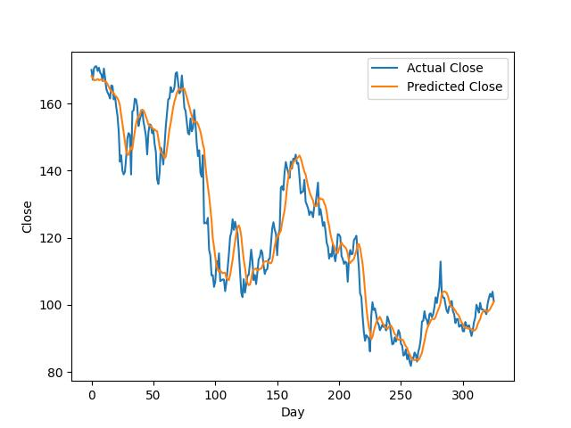

# **Amazon Stock Forecasting with PyTorch LSTM**

This is a little simple project , aim to practice and learn more about hand on machine learning , time series predict and LSTM Model.

## Dataframe After Data Form Convert

| Close | Close(t-1) | Close(t-2) | Close(t-3) | Close(t-4) | Close(t-5) | Close(t-6) | Close(t-7) |
| ----- | ---------- | ---------- | ---------- | ---------- | ---------- | ---------- | ---------- |
| 0     | 0.079167   | 0.075000   | 0.069792   | 0.071354   | 0.081771   | 0.085417   | 0.086458   |
| 1     | 0.076563   | 0.079167   | 0.075000   | 0.069792   | 0.071354   | 0.081771   | 0.085417   |
| 2     | 0.075260   | 0.076563   | 0.079167   | 0.075000   | 0.069792   | 0.071354   | 0.081771   |
| 3     | 0.075000   | 0.075260   | 0.076563   | 0.079167   | 0.075000   | 0.069792   | 0.071354   |
| 4     | 0.075521   | 0.075000   | 0.075260   | 0.076563   | 0.079167   | 0.075000   | 0.069792   |
| ...   | ...        | ...        | ...        | ...        | ...        | ...        | ...        |
| 6504  | 102.000000 | 100.250000 | 97.239998  | 98.040001  | 98.129997  | 98.709999  | 98.699997  |
| 6505  | 103.290001 | 102.000000 | 100.250000 | 97.239998  | 98.040001  | 98.129997  | 98.709999  |
| 6506  | 102.410004 | 103.290001 | 102.000000 | 100.250000 | 97.239998  | 98.040001  | 98.129997  |
| 6507  | 103.949997 | 102.410004 | 103.290001 | 102.000000 | 100.250000 | 97.239998  | 98.040001  |
| 6508  | 101.099998 | 103.949997 | 102.410004 | 103.290001 | 102.000000 | 100.250000 | 97.239998  |

---

    

## Result

 

### Original

### Train Set Result

### Test  Set Result
