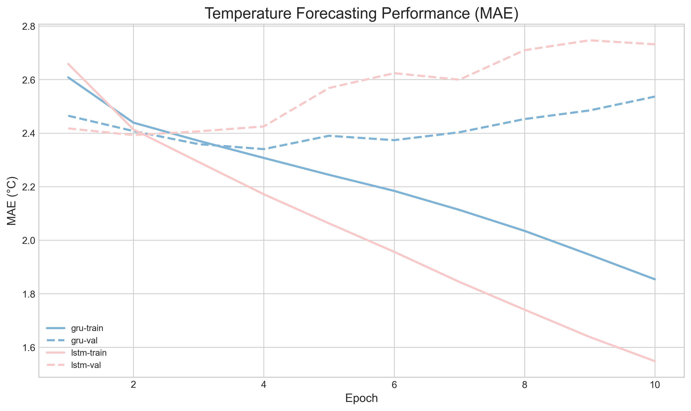
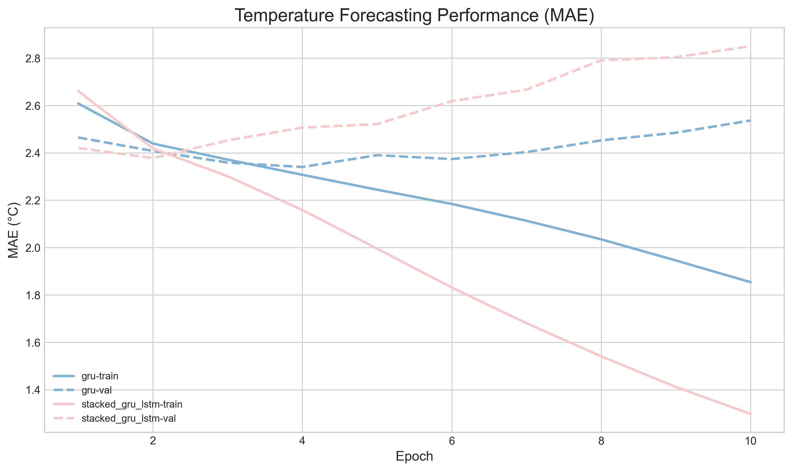
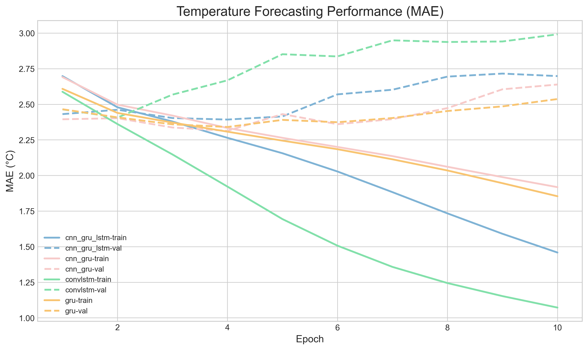
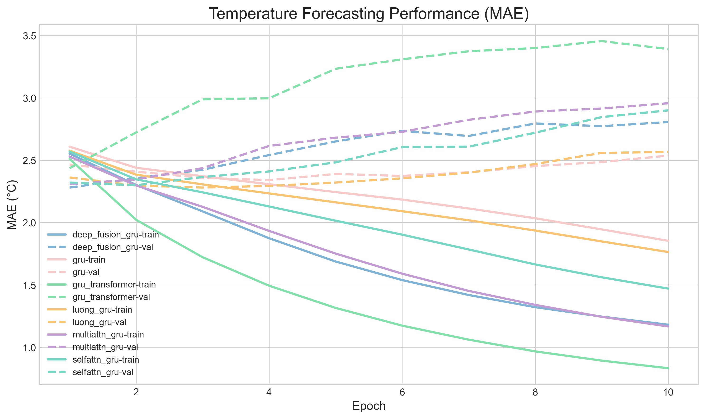
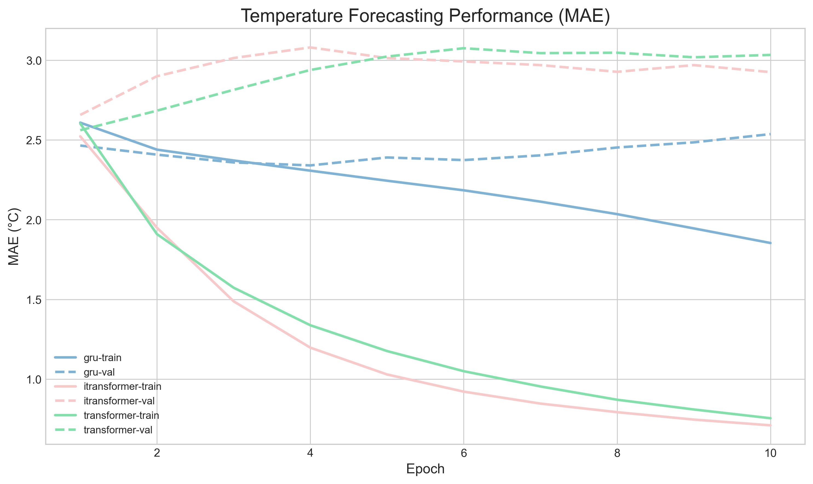

# **Time-Series Temperature Forecasting with Deep Learning**

## Introduction
This project investigates one-step-ahead temperature forecasting on the Jena climate dataset using a family of deep learning models for sequence regression. The central objective is not merely to obtain a predictive model, but to study how different temporal architectures behave under a controlled experimental protocol, where the forecasting horizon, context length, sampling stride, and data split strategy are all fixed and comparable across runs.

The task is formulated as supervised sequence-to-one regression. Given a multivariate historical window of meteorological observations, the model is trained to predict the future value of air temperature at a specified delay. The input is a temporally ordered sequence extracted from the past, while the target is the temperature value at a future timestamp. This setup makes the benchmark suitable for comparing recurrent, convolutional, attention-based, and hybrid architectures under the same forecasting objective.

The dataset is standardized using statistics computed only from the training portion of the time series. This choice is essential for preserving the integrity of the evaluation protocol, because it prevents information from the validation or test period from leaking into the normalization process. The train, validation, and test partitions are created in chronological order rather than randomly, which more accurately reflects the causal structure of forecasting problems and ensures that the reported performance corresponds to genuine forward generalization.

The experimental design emphasizes long-horizon temporal context. Each sample is constructed from a lookback window of past observations, subsampled by a fixed step size, and mapped to a future target separated by a configurable delay. In practice, this allows the study of how well a model can compress long temporal dependencies and exploit intermediate structure in the history when predicting a future temperature value. The resulting sequence length after subsampling becomes the effective temporal resolution seen by the model.

 
Training minimizes mean squared error on normalized targets, while reporting errors in the original physical unit of degrees Celsius. This is important for interpretability, since normalized loss is convenient for optimization but less meaningful for practical evaluation. Mean absolute error and root mean squared error are computed after inverse standardization, providing an assessment of both average deviation and sensitivity to larger forecast errors. The validation root mean squared error is used as the model selection criterion, which is a reasonable choice when the goal is to balance stability and accuracy in a continuous regression setting.

The optimization procedure uses Adam with gradient clipping and early stopping. Gradient clipping helps stabilize training for models that may otherwise exhibit exploding gradients or unusually large parameter updates, especially when long temporal contexts are involved. Early stopping monitors validation performance and terminates training when improvements cease for a configurable patience window. This reduces the risk of overfitting and encourages the selection of a checkpoint that generalizes better to unseen time periods.

 
## Dataset
The dataset used in this project is the Jena climate time series from 2009 to 2016, with temperature prediction as the target variable. The default configuration uses a long historical window, a moderate forecasting delay, and a subsampled temporal stride, which together define a nontrivial sequence modeling problem. These settings are intended to stress the model’s capacity for temporal abstraction rather than short-range interpolation.

A typical experiment produces a best checkpoint selected on the validation set, a per-epoch training record, and prediction outputs for validation and test samples. These outputs are sufficient for both aggregate metric reporting and error analysis at the sample level. The final test metrics should be interpreted as an estimate of out-of-sample forecasting performance under the chosen data split and preprocessing regime.

## Hyperparameters
* Learning Rate = 1e-4
* Batch Size = 128
* Epochs = 10
* Lookback = 720
* Delay = 144
* Step = 3

<h2 align="center">Experimental Results</h2>

  This section summarizes the qualitative comparison across model families and the quantitative evaluation on the validation and test sets.
  All experiments were conducted under the same data split and training protocol.

<table align="center" width="100%" cellspacing="0" cellpadding="12">
  <tr>
    <td align="center" width="50%">
      
       <b>LSTM / GRU</b>
    </td>
    <td align="center" width="50%">
      
       <b>LSTM-GRU Stack</b>
    </td>
  </tr>
  <tr>
    <td align="center" width="50%">
      
       <b>Convolution Layers Fusion with Sequence Models</b>
    </td>
    <td align="center" width="50%">
      
       <b>GRU + Attention</b>
    </td>
  </tr>
<tr>
    <td align="center" width="50%">
      
       <b>Convolution Layers Fusion with Sequence Models</b>
    </td>
    <td align="center" width="50%">
      
       <b></b>
    </td>
  </tr>
  
</table>

 

<h3 align="center">Experimental Results Table</h3>

  Models are ranked by <b>Test MAE</b> in ascending order. Lower values indicate better generalization performance.

<table>
  <thead>
    <tr>
      <th>Rank</th>
      <th>Model</th>
      <th>Val MAE (°C)</th>
      <th>Val RMSE (°C)</th>
      <th>Test MAE (°C)</th>
      <th>Test RMSE (°C)</th>
    </tr>
  </thead>
  <tbody>
    <tr>
      <td align="center">1</td>
      <td>Luong GRU</td>
      <td align="right">2.2809</td>
      <td align="right">2.9597</td>
      <td align="right">2.3615</td>
      <td align="right">3.0017</td>
    </tr>
    <tr>
      <td align="center">2</td>
      <td>GRU</td>
      <td align="right">2.3402</td>
      <td align="right">3.0039</td>
      <td align="right">2.3699</td>
      <td align="right">3.0295</td>
    </tr>
    <tr>
      <td align="center">3</td>
      <td>CNN-GRU-LSTM</td>
      <td align="right">2.3924</td>
      <td align="right">3.0749</td>
      <td align="right">2.4011</td>
      <td align="right">3.0583</td>
    </tr>
    <tr>
      <td align="center">4</td>
      <td>Stacked GRU-LSTM</td>
      <td align="right">2.3778</td>
      <td align="right">3.0688</td>
      <td align="right">2.4124</td>
      <td align="right">3.1054</td>
    </tr>
    <tr>
      <td align="center">5</td>
      <td>ConvLSTM</td>
      <td align="right">2.4064</td>
      <td align="right">3.0758</td>
      <td align="right">2.4247</td>
      <td align="right">3.1002</td>
    </tr>
    <tr>
      <td align="center">6</td>
      <td>Deep Fusion GRU</td>
      <td align="right">2.2803</td>
      <td align="right">2.9548</td>
      <td align="right">2.4355</td>
      <td align="right">3.1263</td>
    </tr>
    <tr>
      <td align="center">7</td>
      <td>LSTM</td>
      <td align="right">2.4065</td>
      <td align="right">3.1090</td>
      <td align="right">2.4500</td>
      <td align="right">3.1271</td>
    </tr>
    <tr>
      <td align="center">8</td>
      <td>Self-Attention GRU</td>
      <td align="right">2.2991</td>
      <td align="right">2.9805</td>
      <td align="right">2.4624</td>
      <td align="right">3.1558</td>
    </tr>
    <tr>
      <td align="center">9</td>
      <td>Multi-Attention GRU</td>
      <td align="right">2.3078</td>
      <td align="right">2.9929</td>
      <td align="right">2.4764</td>
      <td align="right">3.1566</td>
    </tr>
    <tr>
      <td align="center">10</td>
      <td>CNN-GRU</td>
      <td align="right">2.3133</td>
      <td align="right">3.0047</td>
      <td align="right">2.4813</td>
      <td align="right">3.1555</td>
    </tr>
    <tr>
      <td align="center">11</td>
      <td>GRU Transformer</td>
      <td align="right">2.4359</td>
      <td align="right">3.0821</td>
      <td align="right">2.5003</td>
      <td align="right">3.1817</td>
    </tr>
    <tr>
      <td align="center">12</td>
      <td>iTransformer</td>
      <td align="right">2.6568</td>
      <td align="right">3.3594</td>
      <td align="right">2.8136</td>
      <td align="right">3.6841</td>
    </tr>
    <tr>
      <td align="center">13</td>
      <td>Transformer</td>
      <td align="right">2.5609</td>
      <td align="right">3.2844</td>
      <td align="right">2.9268</td>
      <td align="right">3.8932</td>
    </tr>
    <tr>
      <td align="center">14</td>
      <td>N-BEATS</td>
      <td align="right">2.6352</td>
      <td align="right">3.3672</td>
      <td align="right">5.7581</td>
      <td align="right">41.9409</td>
    </tr>
  </tbody>
</table>

  

The empirical results reveal a consistent pattern in which recurrent-based architectures, particularly GRU variants with attention or structured fusion, outperform both pure Transformer models and decomposition-based approaches such as N-BEATS. This outcome can be largely attributed to the inductive biases required for medium-scale, noisy, multivariate time-series forecasting with limited training data.

First, GRU-based models demonstrate strong performance due to their inherent capability to model temporal dependencies with relatively low parameter complexity. Compared to LSTM, GRU achieves similar expressive power with fewer gates, which may lead to more stable optimization under constrained data regimes. The superior ranking of Luong-style attention GRU suggests that lightweight attention mechanisms can effectively enhance temporal feature selection without introducing excessive model variance. In this context, attention likely helps the model focus on informative subregions within the long lookback window, especially under subsampling, where temporal resolution is reduced.

Second, hybrid architectures such as CNN-GRU-LSTM and stacked recurrent models perform competitively, indicating that combining local pattern extraction (via convolution) with sequential modeling (via recurrent units) provides a beneficial inductive bias. These models can capture short-term fluctuations and longer-term dependencies simultaneously, which is particularly relevant in climate data where both periodicity and transient dynamics coexist.

In contrast, Transformer-based models underperform noticeably. This is likely due to their reliance on large-scale data to learn meaningful attention patterns. Without sufficient data, self-attention mechanisms may fail to generalize and instead overfit or underfit. Additionally, the lack of strong locality bias in vanilla Transformers makes them less efficient in capturing structured temporal correlations in relatively small datasets. The poor performance of iTransformer and standard Transformer variants reinforces this limitation.

The extreme degradation observed in N-BEATS suggests instability under this specific configuration. Since N-BEATS is designed for univariate or structured decomposition tasks, its performance may deteriorate when applied directly to multivariate inputs without careful adaptation. The unusually high test error indicates either distribution shift sensitivity or failure to learn stable basis representations.

Overall, the results suggest that models with strong sequential inductive bias and moderate complexity are better suited for this task. Attention mechanisms provide marginal gains when integrated conservatively, while overly flexible architectures without sufficient data support tend to generalize poorly.

## Deep Learning Optimization Techniques

The training pipeline incorporates several optimization strategies to stabilize learning and improve predictive accuracy. First, all input features and the target variable are standardized using statistics computed exclusively from the training split. This standardization transforms the data to zero mean and unit variance, which reduces scale disparities across features and facilitates smoother gradient propagation during optimization. By avoiding data leakage from validation and test sets, this approach also preserves the integrity of the evaluation protocol.

In addition, gradient clipping is applied during backpropagation to constrain the norm of parameter gradients. This is particularly important for sequence models such as RNNs and GRUs, where long temporal dependencies can lead to exploding gradients. By enforcing an upper bound on gradient magnitude, the training process becomes more stable and less sensitive to abrupt parameter updates.

A relatively low learning rate of 1e-4 is also adopted to ensure gradual and controlled convergence. This helps prevent overshooting minima and improves generalization, especially in models with higher capacity or attention mechanisms.

Together, these optimization techniques significantly enhance training stability and model performance, leading to a reduction of approximately **3 to 4 degrees** Celsius in mean absolute error across different architectures.
